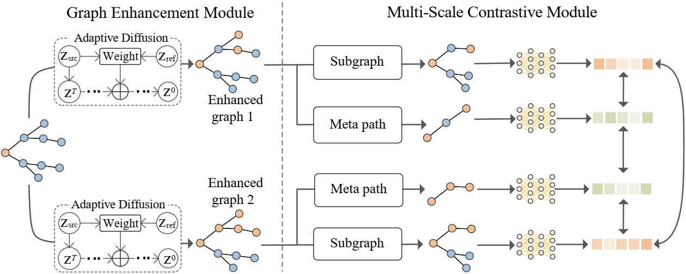

# Graph-Enhanced Multi-Scale Contrastive Learning for Graph Anomaly Detection with Adaptive Diffusion Models

An official source code for paper "Graph-Enhanced Multi-Scale Contrastive Learning for Graph Anomaly Detection with Adaptive Diffusion Models. This paper was submitted to IEEE Transactions on Big Data. Any communications or issues are welcomed. Please contact xiaocj@henu.edu.cn.

-------------

### Overview

 
Graph anomaly detection has gained significant research interest across various domains. Due to the lack of labeled data, contrastive learning has been applied in detecting anomalies and various contrastive strategies have been initiated. However, these methods might force two instances (e.g., node-level and subgraph-level representations) with different category labels to be consistent during model training, which can adversely impact the model robustness. Also, they extract node-level representations only based on node attributes, which are inadequate in reflecting the information of the structural anomaly. To tackle this problem, we present a Graph-enhanced multi-scale Contrastive Learning framework for Anomaly Detection, GCLAD. In this framework, we design a diffusion probabilistic model-based graph enhancement module to adaptively manipulate neighbors to generate enhanced graphs, which can efficiently enhance subgraph-level representations and alleviate the inconsistent problem. Further, we present a multi-scale contrastive module where we introduce meta-paths to exploit a few relevant neighbors to boost node-level representations, and build the multi-scale contrastive losses to promote anomaly detection performance.

    
    

    
    Figure: The framework of GCLAD.

### Requirements

The proposed GCLAD is implemented with python 3.7 on a NVIDIA 3070 GPU. 

Python package information is summarized in **requirements.txt**:

- torch==1.10.2
- dgl==0.4.1
- numpy==1.19.2

### Quick Start

python run.py

### Citation
